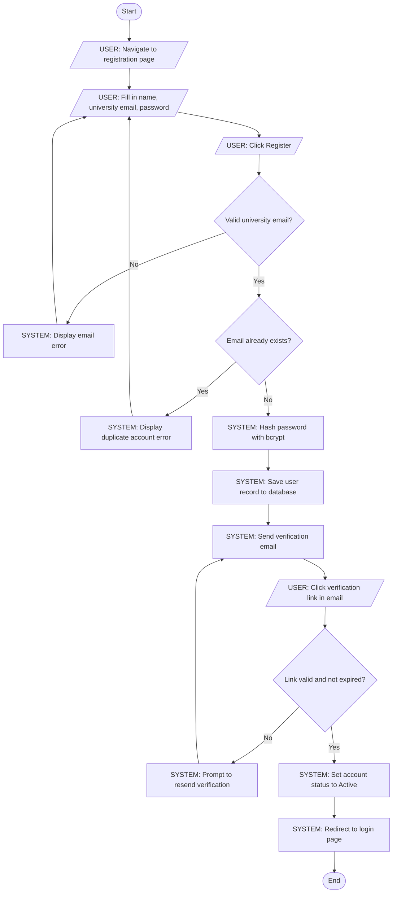
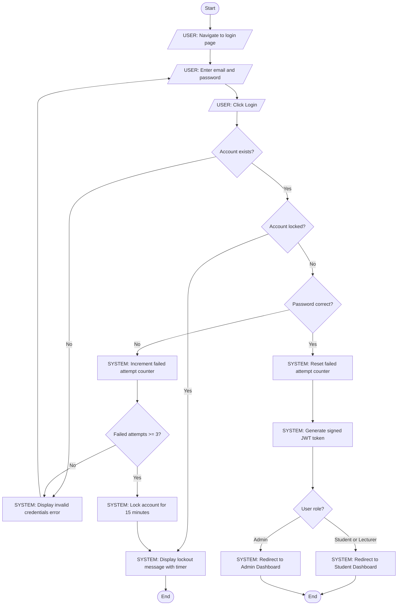
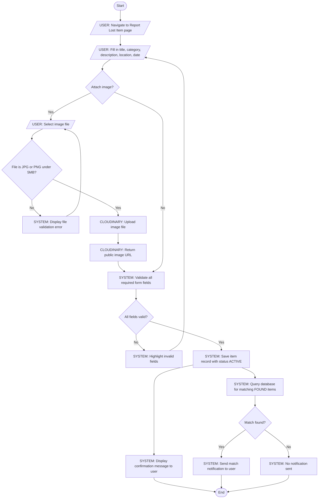
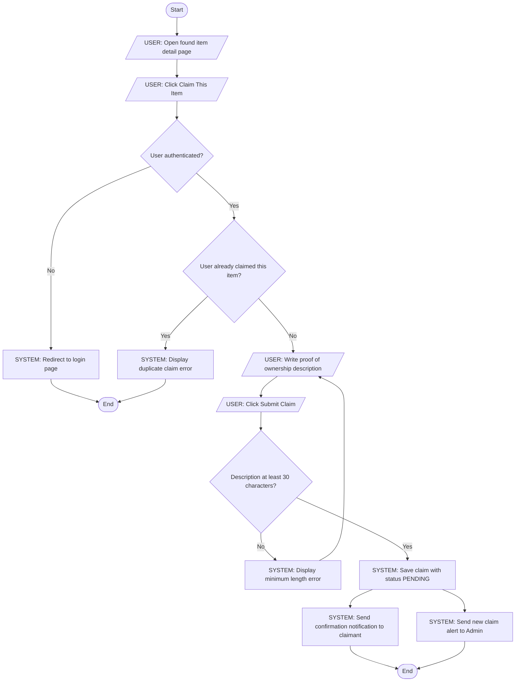
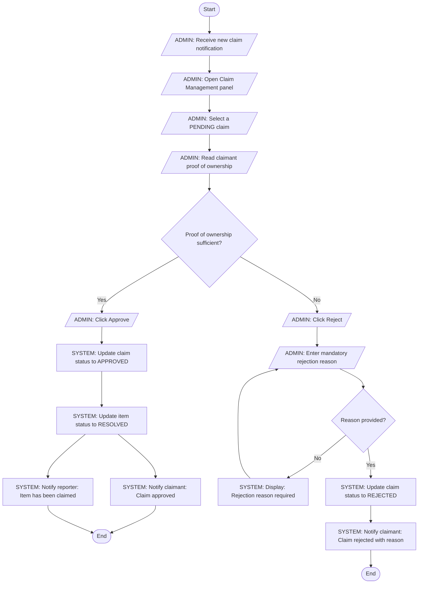
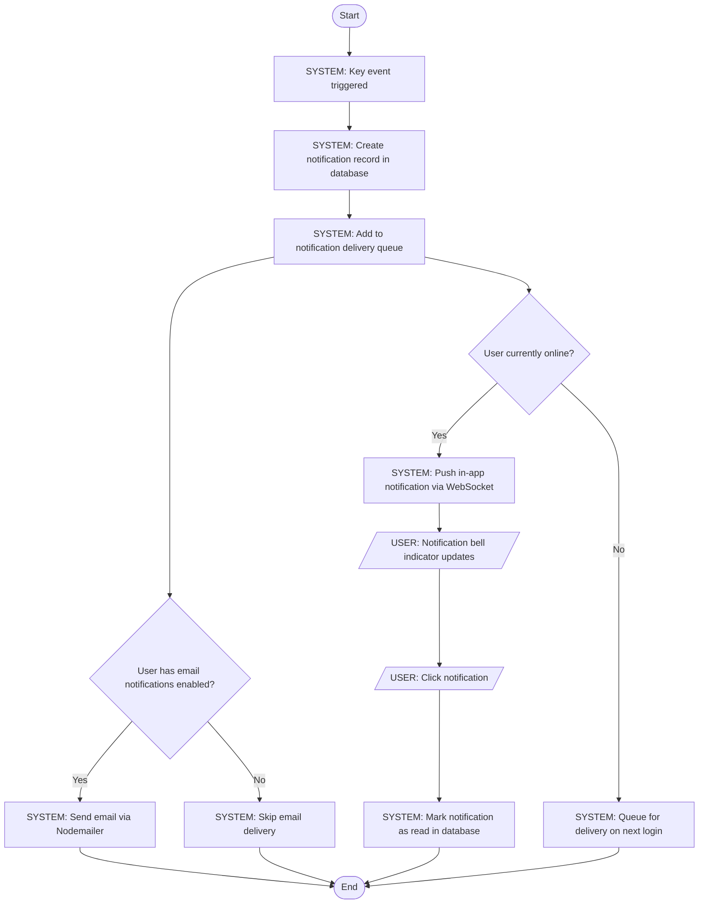
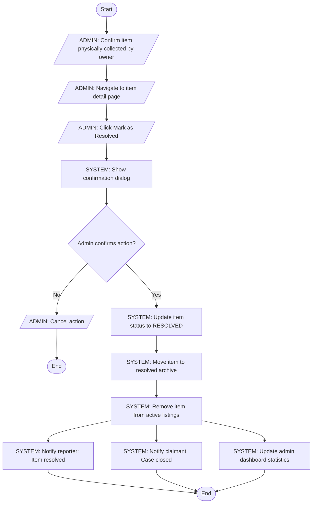
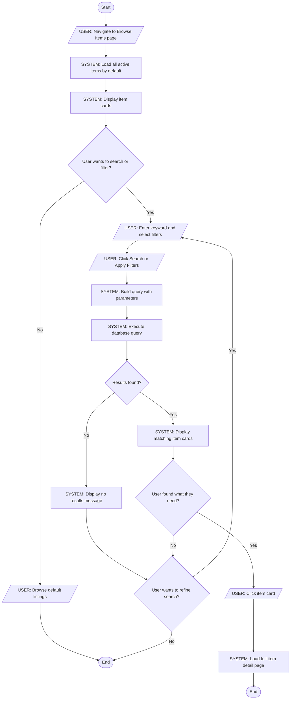

# ACTIVITY_DIAGRAMS.md — Activity Workflow Modeling
## Campus Lost & Found System (CLAFS)

---

## Overview

This document models 8 complex workflows in CLAFS using UML activity diagrams. Each diagram includes start/end nodes, actions, decisions, parallel actions, and swimlane labels showing which actor is responsible for each step.

---

## Workflow 1: User Registration

**Actors:** User, System

**Explanation:**
Covers FR-01 and US-001. The email validation and bcrypt hashing steps ensure only legitimate university members can register securely, addressing both the IT Department's security concerns and the student stakeholder's need for a simple onboarding experience.

**Mapped to:** FR-01, US-001, T-002, T-003, T-004

---

## Workflow 2: User Login and Authentication

**Actors:** User, System

**Explanation:**
Covers FR-02 and US-002. The account lockout logic after 3 failed attempts fulfils NFR-10 (security). Role-based redirect ensures each user type lands on the correct interface immediately after login.

**Mapped to:** FR-02, US-002, T-006, T-007

---

## Workflow 3: Report Lost Item

**Actors:** User, System, Cloudinary

**Explanation:**
Covers FR-03 and FR-08. The parallel execution of showing a confirmation message and running the match query ensures immediate user feedback while the system checks for matches in the background — addressing the student's need for fast item recovery.

**Mapped to:** FR-03, FR-08, US-003, US-008, T-009, T-010

---

## Workflow 4: Submit Claim on Found Item

**Actors:** User, System

**Explanation:**
Covers FR-06 and US-006. The parallel notification to both the claimant and admin ensures no party is left uninformed. The 30-character minimum prevents vague or bad-faith claims, addressing the campus security admin's concern about verified handovers.

**Mapped to:** FR-06, US-006

---

## Workflow 5: Admin Reviews and Approves Claim

**Actors:** Admin, System

**Explanation:**
Covers FR-07 and US-007. The mandatory rejection reason ensures fairness and traceability, addressing the campus security admin's need for a complete audit trail. Parallel notifications on approval keep all parties informed simultaneously.

**Mapped to:** FR-07, US-007

---

## Workflow 6: Receive and Read Notification

**Actors:** System, User

**Explanation:**
Covers FR-09 and US-009. The parallel delivery paths for email and in-app notifications ensure users are informed regardless of whether they are currently active on the platform, addressing the student stakeholder's concern about timely updates.

**Mapped to:** FR-09, US-009

---

## Workflow 7: Mark Item as Resolved

**Actors:** Admin, System

**Explanation:**
Covers FR-10 and US-010. The three parallel post-resolution actions — notifying the reporter, notifying the claimant, and updating dashboard stats — ensure all stakeholders are informed simultaneously and the admin dashboard remains accurate for University Management reporting.

**Mapped to:** FR-10, US-010

---

## Workflow 8: Search and Filter Items

**Actors:** User, System

**Explanation:**
Covers FR-05 and US-005. The looping refinement path ensures users who do not find results on the first search are guided back to try different parameters rather than hitting a dead end — directly addressing the new student stakeholder's need for an intuitive browsing experience.

**Mapped to:** FR-05, US-005

---

## Traceability Summary

| Workflow | Functional Requirement | User Story | Sprint Task |
|----------|----------------------|------------|-------------|
| User Registration | FR-01 | US-001 | T-002, T-003, T-004 |
| User Login | FR-02 | US-002 | T-006, T-007 |
| Report Lost Item | FR-03, FR-08 | US-003, US-008 | T-009, T-010 |
| Submit Claim | FR-06 | US-006 | — |
| Admin Reviews Claim | FR-07 | US-007 | — |
| Receive Notification | FR-09 | US-009 | — |
| Mark as Resolved | FR-10 | US-010 | — |
| Search and Filter | FR-05 | US-005 | — |
