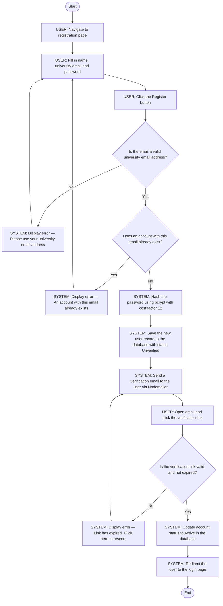
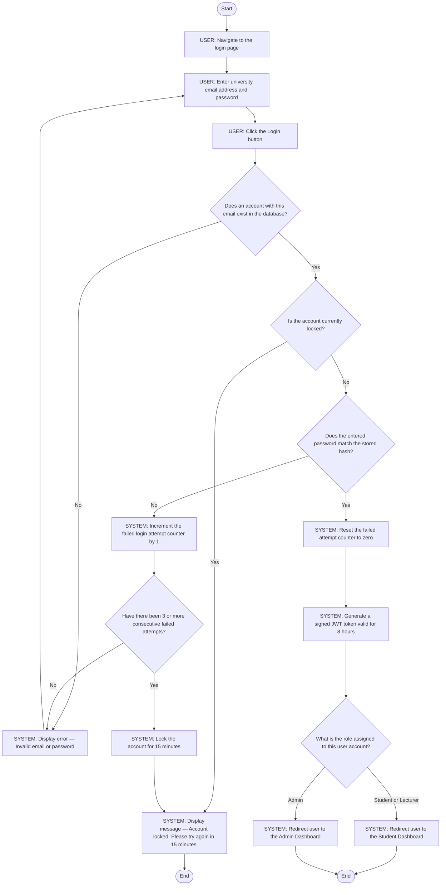
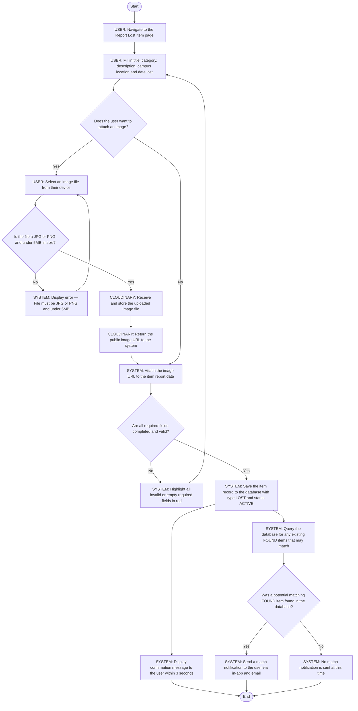
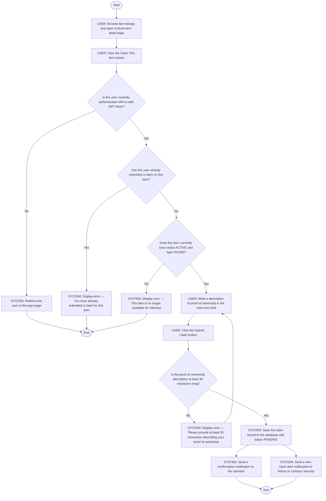
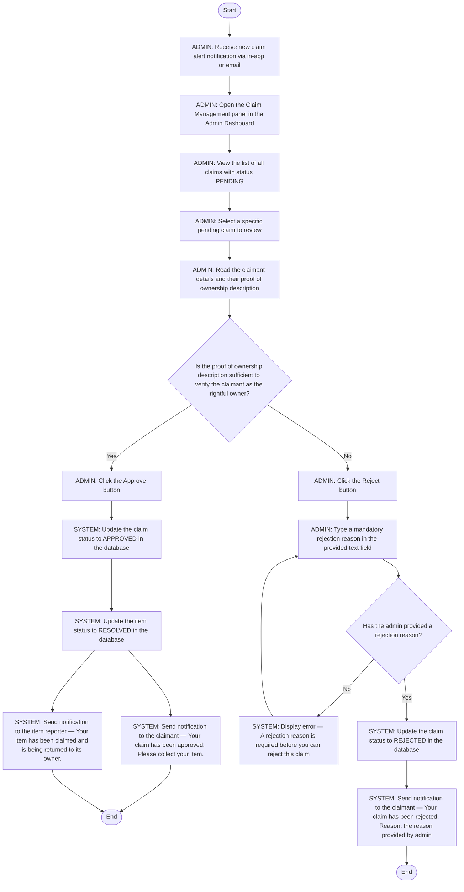
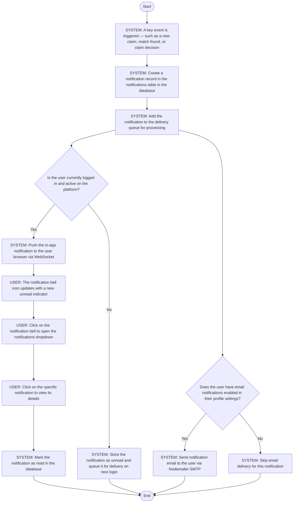
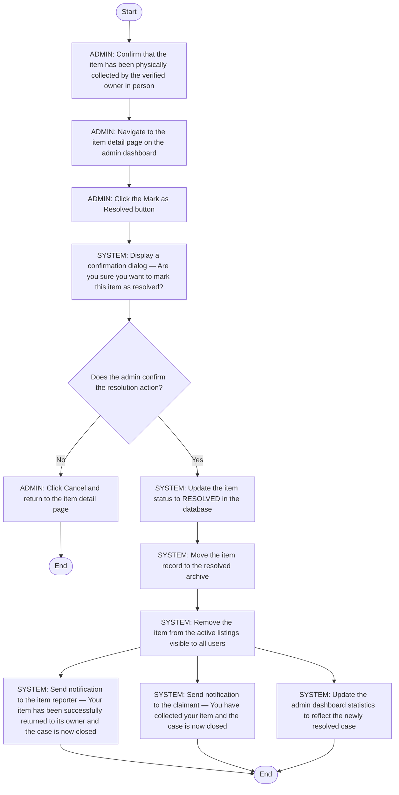
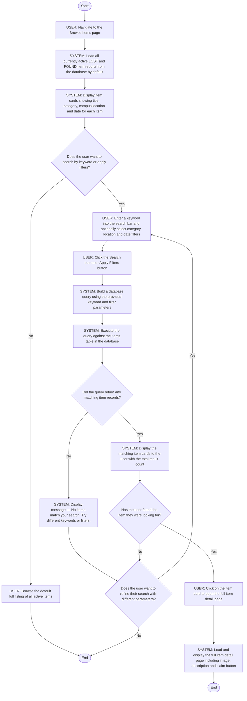

# ACTIVITY_DIAGRAMS.md — Activity Workflow Modeling
## Campus Lost & Found System (CLAFS)

---

## Overview

This document models 8 complex workflows in CLAFS using UML activity diagrams. Each diagram includes start and end nodes, actions, decision points, parallel actions, and actor labels showing who is responsible for each step. All node text is written in full for clarity.

---

## Workflow 1: User Registration

**Actors:** User, System

**Explanation:**
Covers FR-01 and US-001. Email validation and bcrypt hashing ensure only legitimate university members can register securely. The verification email step ensures accounts belong to real university email owners, addressing the IT Department security concern from STAKEHOLDERS.md.

**Mapped to:** FR-01, US-001, T-002, T-003, T-004

---

## Workflow 2: User Login and Authentication

**Actors:** User, System

**Explanation:**
Covers FR-02 and US-002. The lockout logic after 3 consecutive failed attempts fulfils NFR-10. Role-based redirection ensures each user type immediately sees the correct interface after login.

**Mapped to:** FR-02, US-002, T-006, T-007

---

## Workflow 3: Report Lost Item

**Actors:** User, System, Cloudinary

**Explanation:**
Covers FR-03 and FR-08. The parallel execution of showing a confirmation and running the match query ensures immediate user feedback while the system checks for matches in the background. Addresses the student stakeholder's need for fast item recovery.

**Mapped to:** FR-03, FR-08, US-003, US-008, T-009, T-010

---

## Workflow 4: Submit Claim on Found Item

**Actors:** User, System

**Explanation:**
Covers FR-06 and US-006. The parallel notifications to both the claimant and admin ensure no party is left uninformed. The 30-character minimum prevents vague or bad-faith claims, addressing the campus security admin's concern about verified and traceable handovers.

**Mapped to:** FR-06, US-006

---

## Workflow 5: Admin Reviews and Approves or Rejects a Claim

**Actors:** Admin, System

**Explanation:**
Covers FR-07 and US-007. The mandatory rejection reason ensures fairness and a complete audit trail, addressing the campus security admin's need for traceable case management. Parallel notifications on approval keep both the claimant and reporter informed simultaneously.

**Mapped to:** FR-07, US-007

---

## Workflow 6: Receive and Read a Notification

**Actors:** System, User

**Explanation:**
Covers FR-09 and US-009. The parallel delivery paths for email and in-app notifications ensure users are informed regardless of whether they are currently active. Addresses the student stakeholder's concern about timely updates on their reports and claims.

**Mapped to:** FR-09, US-009

---

## Workflow 7: Admin Marks Item as Resolved

**Actors:** Admin, System

**Explanation:**
Covers FR-10 and US-010. The three parallel post-resolution actions — notifying the reporter, notifying the claimant, and updating dashboard statistics — ensure all stakeholders are informed simultaneously and the admin dashboard remains accurate for University Management reporting.

**Mapped to:** FR-10, US-010

---

## Workflow 8: Search and Filter Item Listings

**Actors:** User, System

**Explanation:**
Covers FR-05 and US-005. The looping refinement path ensures users who do not find results on the first attempt are guided back to try different parameters, directly addressing the new student stakeholder's need for an intuitive browsing experience without dead ends.

**Mapped to:** FR-05, US-005

---

## Traceability Summary

| Workflow | Functional Requirement | User Story | Sprint Task |
|----------|----------------------|------------|-------------|
| User Registration | FR-01 | US-001 | T-002, T-003, T-004 |
| User Login | FR-02 | US-002 | T-006, T-007 |
| Report Lost Item | FR-03, FR-08 | US-003, US-008 | T-009, T-010 |
| Submit Claim | FR-06 | US-006 | — |
| Admin Reviews Claim | FR-07 | US-007 | — |
| Receive Notification | FR-09 | US-009 | — |
| Mark as Resolved | FR-10 | US-010 | — |
| Search and Filter | FR-05 | US-005 | — |
