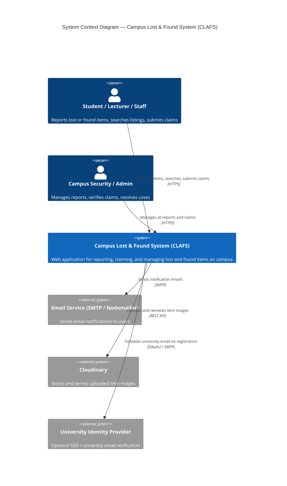
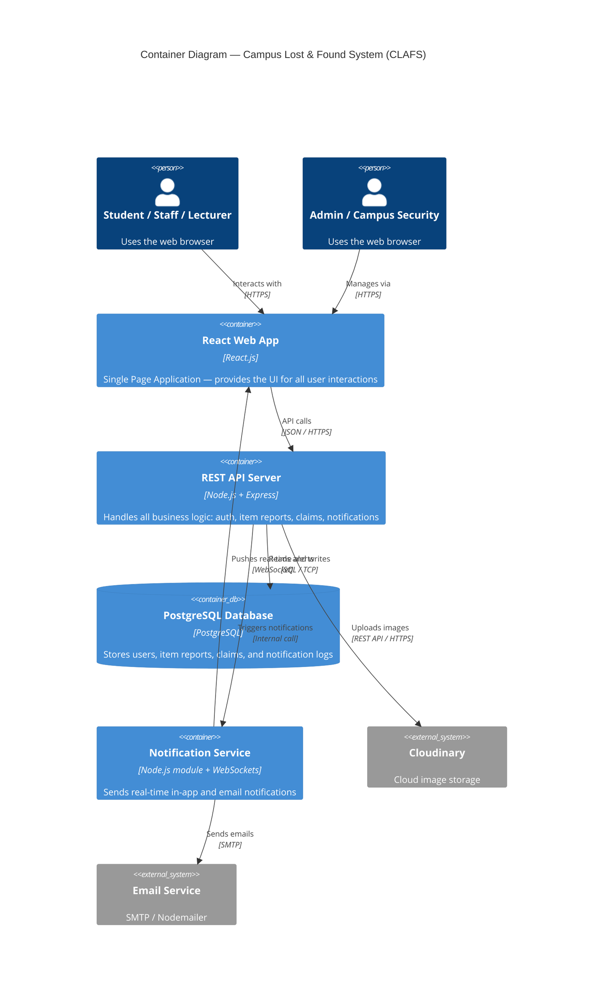
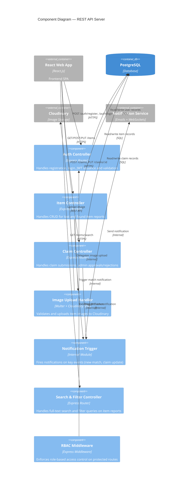
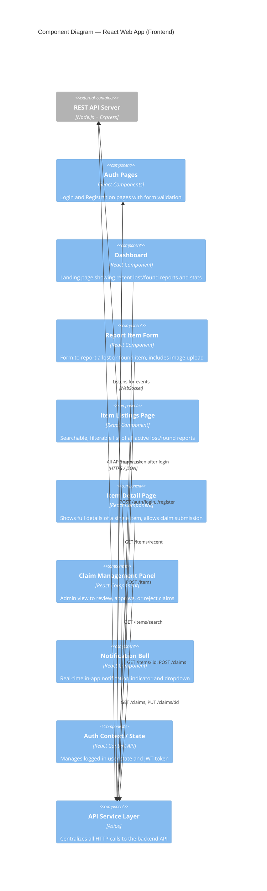

# ARCHITECTURE.md — Campus Lost & Found System

## Project Title
**Campus Lost & Found System (CLAFS)**

---

## Domain
**Higher Education / Campus Services** — A university campus environment where students, lecturers, and security staff interact with a centralized digital platform to report, search, claim, and manage lost and found items.

---

## Problem Statement
Manual lost and found processes on campus are inefficient. CLAFS provides a web-based platform that digitizes item reporting, image uploads, claim verification, and notifications end-to-end.

---

## C4 Architectural Diagrams

The C4 model describes software architecture at four levels of abstraction:
1. **Level 1 — System Context**: Who uses the system and what external systems it interacts with
2. **Level 2 — Container**: The major deployable units (apps, databases, services)
3. **Level 3 — Component**: The internal components within each container
4. **Level 4 — Code**: (Described in prose for key components)

---

## Level 1 — System Context Diagram

> Shows CLAFS and its relationships with users and external systems.



---

## Level 2 — Container Diagram

> Shows the major deployable components of CLAFS and how they communicate.



---

## Level 3 — Component Diagram: REST API Server

> Shows the internal components of the backend API server.



---

## Level 3 — Component Diagram: React Web App

> Shows the internal structure of the frontend SPA.



---

## Level 4 — Key Design Decisions (Code Level)

### Authentication Flow
- User registers with university email → password hashed with `bcrypt` → stored in `users` table
- On login, a signed **JWT token** is returned → stored in browser `localStorage`
- All protected API routes validate the JWT via `rbacMiddleware` before processing

### Item Reporting Flow
1. User fills the Report Form → submits with optional image
2. Image is sent to `imageController` → uploaded to **Cloudinary** → URL returned
3. Item record (with Cloudinary URL) saved to `items` table in PostgreSQL
4. `notifController` checks for potential matches and fires notifications if found

### Claim & Verification Flow
1. User clicks "Claim This Item" on the Item Detail Page
2. Claim record created in `claims` table with status `PENDING`
3. Admin reviews claim in Claim Management Panel
4. Admin approves → status updated to `APPROVED` → both parties notified
5. Item status updated to `RESOLVED` once physically retrieved

---

## Database Schema (Summary)

```
users         → id, name, email, password_hash, role, created_at
items         → id, user_id, type (LOST/FOUND), title, description, location, date, image_url, status, created_at
claims        → id, item_id, claimant_id, description, status (PENDING/APPROVED/REJECTED), created_at
notifications → id, user_id, message, is_read, created_at
```
