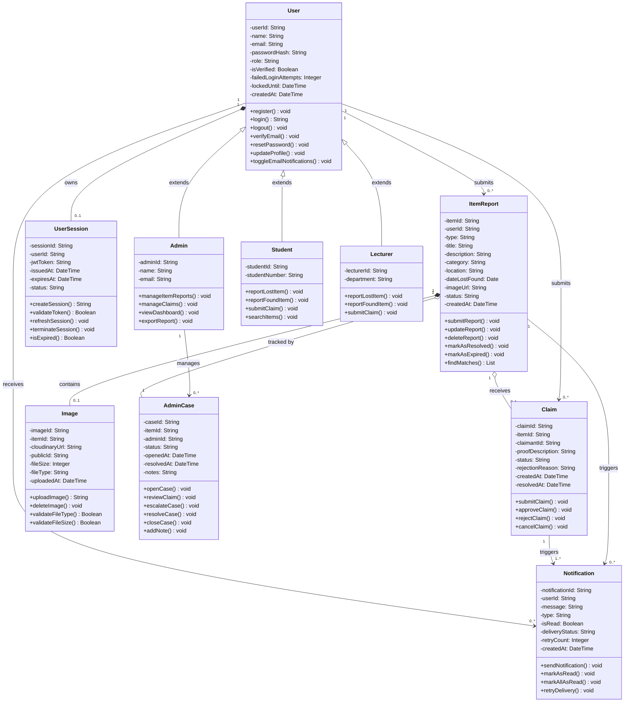

# CLASS_DIAGRAM.md — Class Diagram
## Campus Lost & Found System (CLAFS)

---

## Class Diagram

---

## Key Design Decisions

### 1. Inheritance for User Roles
`Admin`, `Student`, and `Lecturer` all extend the base `User` class. This avoids duplicating shared attributes like `userId`, `email`, `passwordHash`, and `createdAt` across three separate classes. Each subclass adds only what is unique to that role — for example `Student` has `studentNumber` and `Lecturer` has `department`. This directly reflects the role-based access control (RBAC) implemented in FR-02.

### 2. Composition for UserSession and Image
`UserSession` is modelled as a **composition** with `User` because a session cannot exist independently of a user — if the user account is deleted, the session is meaningless. Similarly, `Image` is a composition with `ItemReport` because an image has no purpose outside of the report it belongs to.

### 3. Aggregation for Claims and AdminCase
`Claim` is modelled as an **aggregation** with `ItemReport` because claims can exist and be queried independently (e.g., to list all claims by a specific user), even though they are conceptually part of an item's lifecycle. `AdminCase` is also an aggregation — it tracks the item report's administrative lifecycle but is a separate concern from the report itself.

### 4. Notification as a Standalone Class
`Notification` is associated with both `User`, `ItemReport`, and `Claim` because notifications can be triggered by either an item event (e.g., match found) or a claim event (e.g., claim approved). Keeping it as a standalone class rather than embedding it in other classes makes the notification system extensible — new event types can be added without changing the core entities.

### 5. Multiplicity Choices
- `User "1" *-- "0..1" UserSession` — a user can be logged in or not, but never has more than one active session at a time
- `ItemReport "1" *-- "0..1" Image` — an item report may or may not have an image attached
- `ItemReport "1" o-- "0..*" Claim` — a found item can receive multiple claims, but a lost item report typically receives none
- `Claim "1" --> "1..*" Notification` — every claim action (submitted, approved, rejected) must trigger at least one notification

### 6. Alignment with Prior Assignments
- **FR-02 (REQUIREMENTS.md):** The `User` class with `role`, `failedLoginAttempts`, and `lockedUntil` attributes directly implements the authentication and lockout requirements
- **UC-05 (USECASES.md):** The `Claim` class with `proofDescription` and the 30-character business rule maps to the Submit Claim use case
- **State Diagrams (STATE_DIAGRAMS.md):** The `status` attributes on `ItemReport`, `Claim`, `Notification`, and `UserSession` directly reflect the states defined in the state transition diagrams
- **US-007 (USER_STORIES.md):** The `AdminCase` class with `reviewClaim()`, `escalateCase()`, and `resolveCase()` methods implements the admin claim review user story
