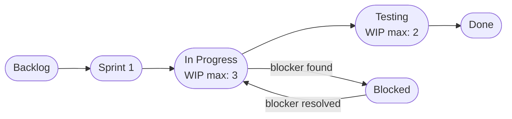

# KANBAN_EXPLANATION.md — Kanban Board Definition and Usage
## Campus Lost & Found System (CLAFS)

---

## 1. What is a Kanban Board?

A Kanban board is a visual project management tool that represents the flow of work through a series of clearly defined stages. Each stage is displayed as a column on the board, and each task is represented as a card that moves from left to right across the columns as it progresses — from not yet started, through active development, to completion.

The word "Kanban" comes from Japanese, meaning "visual signal" or "card." The core idea is simple: by making all work visible on a single board, every team member or in this case, the solo developer can see exactly what is being worked on, what is waiting, and what has been completed at any given moment.

A well-designed Kanban board has three defining characteristics:

- **Visualisation** : all tasks are visible, their status is clear, and nothing is hidden in a spreadsheet or someone's head
- **Work-in-Progress (WIP) limits** : a cap on how many tasks can be in any one stage at a time, preventing overload and bottlenecks
- **Flow** : tasks move continuously and smoothly from one stage to the next, with the goal of completing work as efficiently as possible

---

## 2. The CLAFS Kanban Board

### 2.1 Board Structure

The CLAFS project board was built on GitHub Projects using the **Automated Kanban** template and customized with two additional columns to better reflect the actual development workflow.

| Column | Purpose | WIP Limit |
|--------|---------|-----------|
| **Backlog** | All user stories and tasks not yet scheduled for the current sprint | No limit |
| **Sprint 1** | Items selected and committed to for Sprint 1 | No limit |
| **In Progress** | Items actively being developed right now | 3 tasks max |
| **Testing** | Items that have been developed and are awaiting testing and verification | 2 tasks max |
| **Blocked** | Items that cannot proceed due to a dependency, missing information, or external factor | No limit |
| **Done** | Completed and verified items | No limit |

---

### 2.2 How the Board Visualises Workflow

Each GitHub Issue whether a user story (US-001 to US-014) or a development task (T-001 to T-010) appears as a card on the board. The card shows the issue title, assigned labels (e.g. `must-have`, `sprint-1`, `security`), and the linked milestone.

As development progresses, cards move left to right:

This makes it immediately clear:
- Which features are planned but not started (Backlog)
- Which are committed to this sprint (Sprint 1)
- Which are actively being coded (In Progress)
- Which are being tested (Testing)
- Which are complete (Done)
- Which are stuck and need attention (Blocked)

---

### 2.3 How WIP Limits Prevent Bottlenecks

The **In Progress** column is limited to **3 tasks at a time**. This is a deliberate constraint based on Kanban principles. If more than 3 tasks are in progress simultaneously, it is a signal that work is being spread too thin context switching between too many tasks reduces quality and slows everything down.

For a solo developer, this limit enforces focus: finish what is started before picking up something new. If a task gets blocked, it moves to the **Blocked** column so it does not artificially inflate the In Progress count, and a new task can be pulled in from Sprint 1.

The **Testing** column is limited to **2 tasks** for the same reason verifying more than 2 items at once leads to rushed or incomplete testing.

---

### 2.4 How the Board Supports Agile Principles

| Agile Principle | How the CLAFS Board Supports It |
|----------------|--------------------------------|
| **Visualise work** | All 24 items (14 user stories + 10 tasks) are visible on one board |
| **Continuous delivery** | Automated Kanban moves issues to Done when PRs are merged, encouraging frequent small deliveries |
| **Adaptability** | New issues can be added to the Backlog at any time as requirements evolve |
| **Focus** | WIP limits on In Progress and Testing prevent overcommitment |
| **Transparency** | Labels, milestones, and column positions make the state of every item clear at a glance |
| **Iterative progress** | Sprint 1 column contains only the committed work for this iteration, keeping scope controlled |

---

### 2.5 Customisation Choices Explained

**Why "Testing" column was added:**
The default Automated Kanban template jumps directly from "In Progress" to "Done". For CLAFS, this skips a critical step, verifying that the feature actually works as specified in the acceptance criteria defined in Assignment 5. The Testing column ensures no item is marked Done without being verified against its test cases from `TEST_CASES.md`.

**Why "Blocked" column was added:**
As a solo developer, blockers are common waiting for a Cloudinary API key, an SMTP configuration issue, or a dependency that is not yet built. Without a Blocked column, stuck items would either stay in In Progress (inflating the count) or be moved back to the backlog (losing their sprint context). The Blocked column keeps them visible and in their sprint context until they can be unblocked.

**Why "Sprint 1" column was added:**
The default template does not distinguish between the full backlog and the current sprint commitment. Adding a Sprint 1 column creates a clear visual separation between "everything we plan to do eventually" (Backlog) and "what we have committed to deliver in the next two weeks" (Sprint 1).
