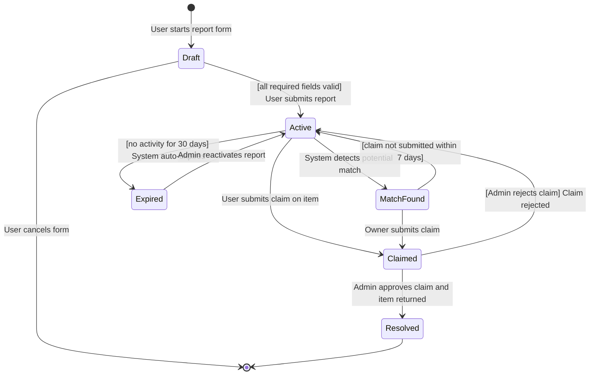
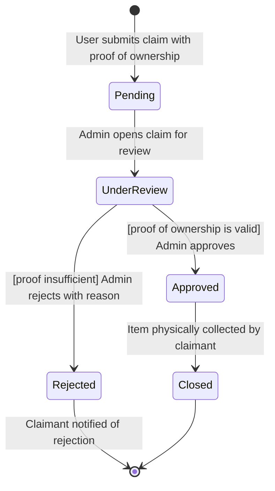
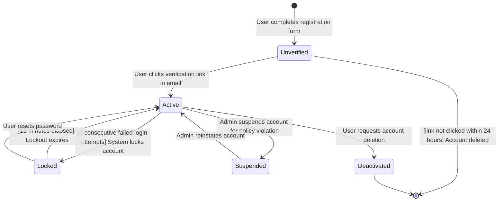
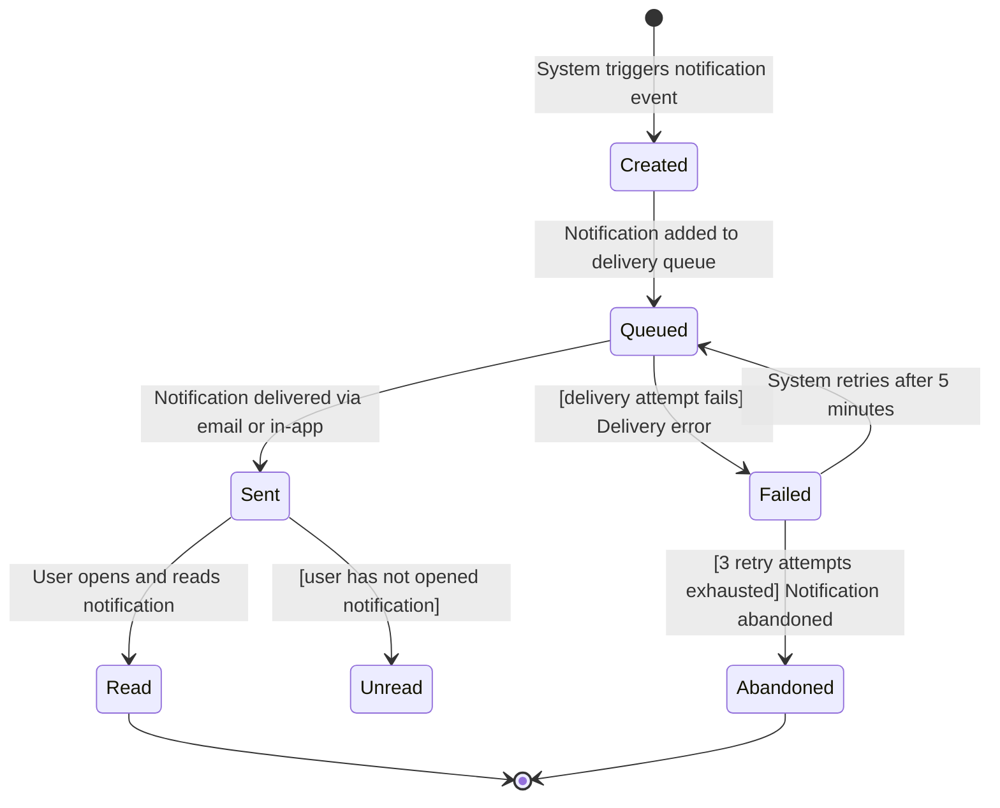
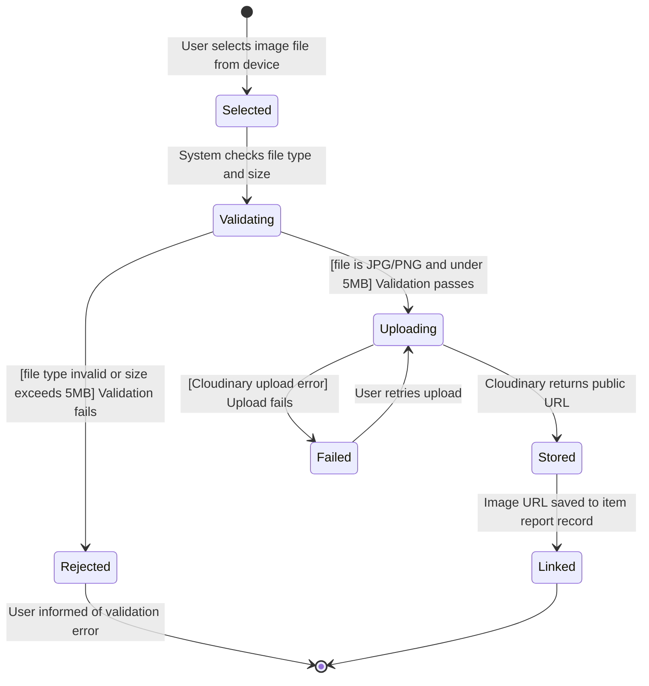
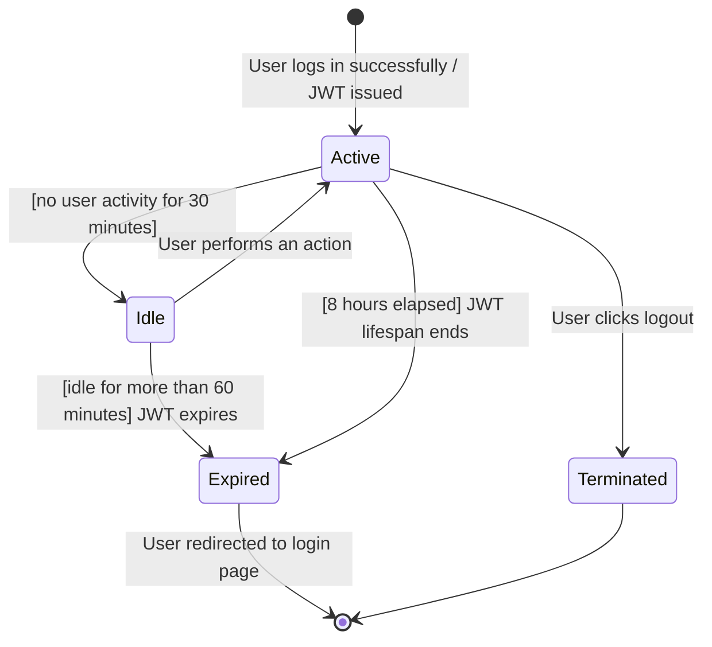
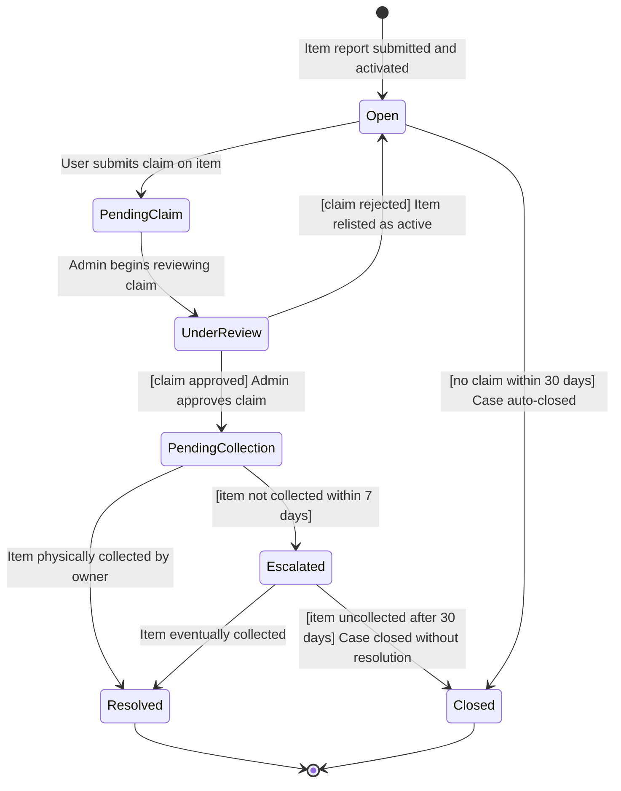
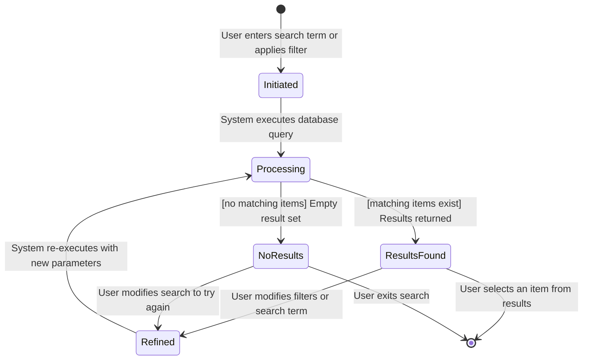

# STATE_DIAGRAMS.md — Object State Modeling
## Campus Lost & Found System (CLAFS)

---

## Overview

This document models the dynamic lifecycle of 8 critical objects in the CLAFS system using UML state transition diagrams. Each diagram shows how an object moves through states in response to events, and where applicable, includes guard conditions that control transitions.

---

## Object 1: Item Report

An item report is the core entity of CLAFS. It is created when a user reports a lost or found item and progresses through states until the case is resolved.

**Key States:**
- `Draft` — report form is being filled in but not yet submitted
- `Active` — report is live and visible on the listings
- `MatchFound` — system has detected a potential matching item
- `Claimed` — at least one claim has been submitted on this item
- `Resolved` — item has been physically returned to its owner
- `Expired` — item was not resolved within 30 days and was auto-archived

**Mapped Requirements:** FR-03, FR-04, FR-10 — covers the full lifecycle of reporting, claiming, and resolving items.

---

## Object 2: Claim

A claim is submitted by a user who believes a found item belongs to them. It goes through an admin review process before being resolved.

**Key States:**
- `Pending` — claim submitted, awaiting admin attention
- `UnderReview` — admin is actively reviewing the claim
- `Approved` — admin verified the claimant as the rightful owner
- `Rejected` — claim did not meet the proof of ownership standard
- `Closed` — item has been collected and the case is fully closed

**Guard Conditions:**
- Transition to `Approved` only if proof of ownership description is sufficient
- Transition to `Rejected` requires admin to provide a mandatory rejection reason

**Mapped Requirements:** FR-06, FR-07 — covers the claim submission and admin review workflow.

---

## Object 3: User Account

A user account is created on registration and can be in various states depending on verification and activity.

**Key States:**
- `Unverified` — registered but email not yet confirmed
- `Active` — fully functioning account
- `Locked` — temporarily blocked after failed login attempts
- `Suspended` — admin-imposed block for policy violations
- `Deactivated` — user-requested account removal

**Guard Conditions:**
- Account only becomes `Active` if the verification link is clicked within 24 hours
- Account locks only after exactly 3 consecutive failed attempts

**Mapped Requirements:** FR-01, FR-02, NFR-10 — covers registration, authentication, and security lockout.

---

## Object 4: Notification

A notification is generated by the system in response to key events and is delivered to the relevant user.

**Key States:**
- `Created` — notification record created in the database
- `Queued` — waiting in the delivery queue
- `Sent` — successfully delivered to the user
- `Failed` — delivery attempt was unsuccessful
- `Read` — user has seen and opened the notification
- `Abandoned` — all retry attempts exhausted

**Guard Conditions:**
- Retry only if fewer than 3 attempts have been made
- Transition to `Abandoned` only after 3 failed attempts

**Mapped Requirements:** FR-09 — covers the full notification delivery lifecycle.

---

## Object 5: Image Upload

An image is optionally attached to an item report. It goes through validation and cloud storage before being linked to the report.

**Key States:**
- `Selected` — user has chosen a file but upload not started
- `Validating` — system checking file type and size
- `Uploading` — file is being sent to Cloudinary
- `Stored` — file is saved on Cloudinary and URL returned
- `Linked` — URL saved to the item report in the database
- `Rejected` — file failed validation
- `Failed` — Cloudinary upload encountered an error

**Guard Conditions:**
- Only proceeds to `Uploading` if file is JPG/PNG AND under 5MB

**Mapped Requirements:** FR-08 — covers image upload and Cloudinary integration.

---

## Object 6: User Session

A user session is created on login and managed through activity and expiry.

**Key States:**
- `Active` — user is logged in and interacting with the system
- `Idle` — no activity detected for 30 minutes
- `Expired` — JWT token has passed its validity window
- `Terminated` — user explicitly logged out

**Guard Conditions:**
- Session expires after 8 hours regardless of activity
- Idle session expires after 60 minutes of inactivity

**Mapped Requirements:** FR-02, NFR-04 — covers JWT session management and security.

---

## Object 7: Admin Case

An admin case groups all activity related to a specific item report, from the first report through to final resolution.

**Key States:**
- `Open` — active case with no claims yet
- `PendingClaim` — at least one claim submitted, awaiting review
- `UnderReview` — admin is actively working the case
- `PendingCollection` — claim approved, waiting for physical item collection
- `Resolved` — item collected, case fully closed
- `Escalated` — approved claim holder has not collected within 7 days
- `Closed` — case closed without resolution

**Mapped Requirements:** FR-07, FR-10 — covers admin case management from open to resolution.

---

## Object 8: Search Query

A search query is initiated by a user and returns filtered results from the active item listings.

**Key States:**
- `Initiated` — search term or filter submitted
- `Processing` — database query running
- `ResultsFound` — matching records returned and displayed
- `NoResults` — query returned an empty set
- `Refined` — user is adjusting search parameters

**Mapped Requirements:** FR-05 — covers the search and filter functionality lifecycle.
