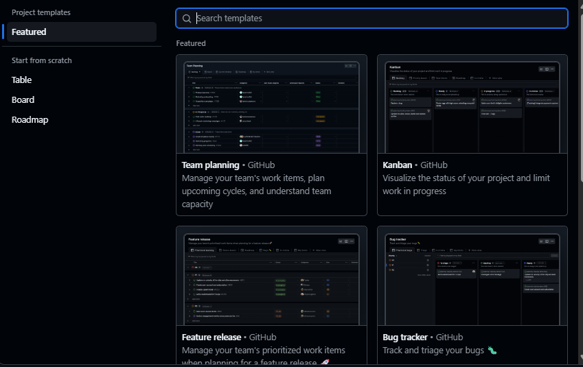

# TEMPLATE_ANALYSIS.md — GitHub Project Template Analysis
## Campus Lost & Found System (CLAFS)

---

## 1. GitHub Project Templates Overview

GitHub Projects offers several pre-built templates designed to support different software development workflows. This document evaluates four templates and justifies the selection made for the CLAFS project.

---

## 2. Template Comparison Table

| Feature | Basic Kanban | Automated Kanban | Bug Triage | Team Planning |
|---------|-------------|-----------------|------------|---------------|
| **Best For** | Small projects, simple workflows, beginners | Agile teams running sprints with CI/CD pipelines | Teams managing bug backlogs and QA workflows | Teams planning and distributing work across members |
| **Agile Suitability** | **Low**  (no automation or sprint tracking) | **High** (automation aligns with iterative delivery) | **Medium** (useful for QA but not full Agile workflow) | **Medium** (good for planning but lacks automation) |
| **Default Columns** | To Do, In Progress, Done | To Do, In Progress, Done | Needs Triage, High Priority, Low Priority, Closed | To Do, In Progress, Done |
| **Automation** | **None** (all movement is manual) | Issues auto-move when opened, closed, or PRs merged | Issues auto-move to Needs Triage when created | **None** (manual management) |
| **WIP Limits** | Not built-in | Not built-in | Not built-in | Not built-in |
| **Sprint Support** | **Limited** (no milestone linking by default) | **Good** (automation reduces manual overhead during sprints) | Not designed for sprints | **Good** (designed for team task allocation) |
| **Issue Linking** | Manual | Automatic via PR and issue events | Automatic via issue creation | Manual |
| **Customization** | **Easy** (add columns manually) | **Moderate** (automation rules need configuring) | **Moderate** (columns are bug-focused, need renaming) | **Easy** (straightforward column addition) |
| **Suitable for CLAFS** | Partially | Yes (best fit) | No (bug-focused) | Partially |

---

## 3. Chosen Template: Automated Kanban

### Justification

The **Automated Kanban** template was selected for CLAFS for the following reasons:

**1. Automation reduces manual overhead.**
As a solo developer, manually moving every issue across columns as work progresses is time-consuming and easy to forget. The Automated Kanban template automatically moves issues to "In Progress" when a linked branch is created and to "Done" when a pull request is merged. This keeps the board accurate without requiring constant manual updates.

**2. It aligns with the Sprint planning done in Assignment 6.**
The sprint backlog, user stories, and task issues created in Assignment 6 map directly onto the Automated Kanban columns. Sprint 1 items start in "To Do", move to "In Progress" during development, and close out in "Done" matching the sprint lifecycle.

**3. It supports Agile principles.**
Automated Kanban supports continuous delivery by keeping the workflow visible and up to date at all times. It encourages small, frequent commits and pull requests, core Agile practices because each PR triggers a board update.

**4. It is extensible.**
The template's default 3 columns can be extended with custom columns like "Testing" and "Blocked", which were added to the CLAFS board to reflect the actual development workflow more accurately.

**5. It is industry standard.**
Automated Kanban on GitHub is widely used in professional software teams. Working with it as a student developer builds directly transferable skills for real-world Agile environments.

---

## 4. Why the Other Templates Were Not Selected

| Template | Reason Not Selected |
|----------|-------------------|
| **Basic Kanban** | No automation, it requires all board updates to be done manually, which is inefficient for a solo developer |
| **Bug Triage** | Designed specifically for bug management workflows, not for feature development and sprint planning |
| **Team Planning** | Focused on distributing work across team members less relevant for a solo project with no collaboration |

## 5. Template Selection Screenshot

