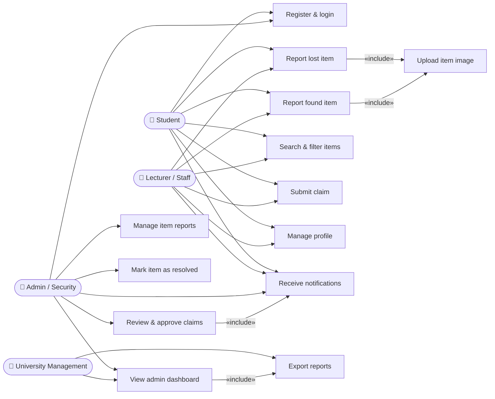

# USECASES.md — Use Case Modeling
## Campus Lost & Found System (CLAFS)

---

## 1. Use Case Diagram

> Rendered using Mermaid JS. Student and Lecturer/Staff are independent actors with no generalisation relationship — they share the same use cases because they hold the same system role, not because one is a subtype of the other.

---

## 2. Written Explanation

### 2.1 Key Actors and Their Roles

| Actor | Role in the System |
|-------|--------------------|
| **Student** | Primary user. Registers, reports lost/found items, searches listings, submits claims, receives notifications, and manages their profile. |
| **Lecturer / Staff** | Independent actor with the same system capabilities as a Student. Not a subtype of Student — they are a separate user group who happen to access the same use cases. Carries elevated trust during claim verification. |
| **Admin / Campus Security** | System manager. Manages all reports and claims, approves or rejects claims, marks cases as resolved, and monitors the admin dashboard. |
| **University Management** | Read-only strategic stakeholder. Views the admin dashboard and exports monthly reports. Cannot create or modify any records. |

---

### 2.2 Relationships Between Actors and Use Cases

**No Generalisation Between Student and Lecturer:**
Student and Lecturer/Staff are modelled as fully **independent actors**. A lecturer at CPUT was not necessarily a student at CPUT. They access the same use cases because they share the same **system role** (regular user), not because one inherits from the other.

**Include Relationships (mandatory — always automatically triggered):**
- `Report Lost Item` and `Report Found Item` both **include** `Upload Item Image` — every item report passes through the image upload handler, even if the image is optional.
- `Review & Approve Claims` **includes** `Receive Notifications` — every claim decision automatically triggers a notification to the relevant parties.
- `View Admin Dashboard` **includes** `Export Reports` — the export function is always accessible from within the dashboard.

**Extend Relationships (optional — conditionally triggered):**
- `Report Lost Item` **extends** `Receive Notifications` — after a report is submitted, the system optionally fires a match notification *only if* a matching found item already exists in the system.

**Note on Submit Claim and Search & Filter:**
`Submit Claim` does **not** include `Search & Filter Items`. A user may use Search & Filter independently to find an item before claiming it, but this is not automatically triggered by the claim action. Search & Filter is modelled as a **precondition** in the use case specification — something that should have happened before the use case starts — not as an include relationship.

---

### 2.3 How the Diagram Addresses Stakeholder Concerns

| Stakeholder | Concern (from Assignment 4) | Use Case(s) That Address It |
|-------------|-----------------------------|-----------------------------|
| Student (item loser) | Fast, easy way to report lost items and be notified | UC2 (Report lost item), UC7 (Notifications) |
| Student (item finder) | Simple way to report found items responsibly | UC3 (Report found item), UC9 (Admin claim review) |
| Lecturer / Staff | Same capabilities as students, elevated trust in verification | UC2, UC3, UC4, UC5 — as independent actor |
| Admin / Campus Security | Centralised management and full digital audit trail | UC9, UC10, UC11, UC12 |
| University Management | Usage statistics and outcome visibility | UC12 (Dashboard), UC13 (Export) |
